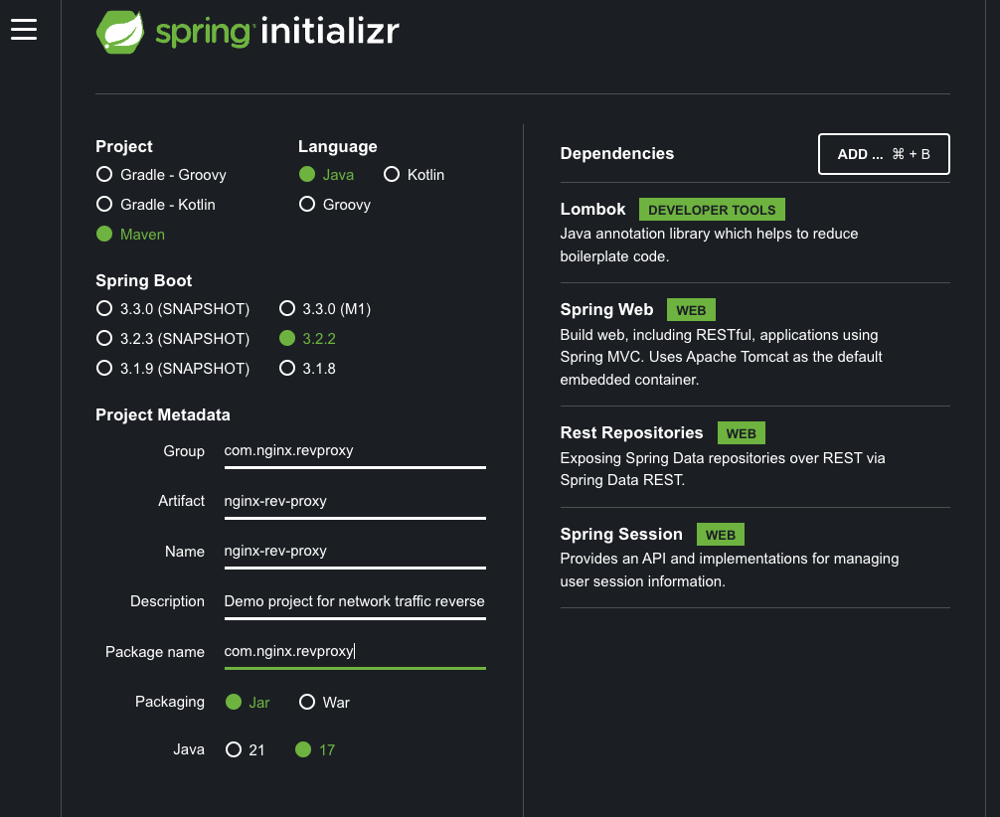
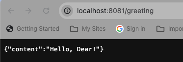
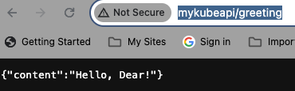

# nginx-rev-proxy
A starter repo to explore the traffic reverse proxying via nginx.

## Pre-requisites (If mac, all can be installed via brew)
* Maven 3+
* Jdk 17+
* nginx (detailed explanation for a Mac M2 given below later, above two should be similar)

## Project creation steps
- Created a Spring boot starter project with Spring web and other dependencies as shown from https://start.spring.io/. Refer below: 
- Modified the server port in [application.properties](src/main/resources/application.properties) to 8081. This is optional, done to ensure we do not conflict with nginx default port 8080 as an oversight later. Otherwise, change is not a mandate.
- Modify the [controller](src/main/java/com/nginx/revproxy/greeting/controller/GreetingController.java) and [data](src/main/java/com/nginx/revproxy/greeting/data/Greeting.java) classes as in this directory.
- Build the project, skip tests for now: `mvn clean install -DskipTests=true`
- Start the [NginxReverseProxyApplication](src/main/java/com/nginx/revproxy/NginxReverseProxyApplication.java) class. 
- The application should now be accessible at http://localhost:8081/greeting. Refer below: 
- 

## Nginx reverse proxy
### Set Up and file locations (file locs are relevant as per Mac M2)
* `brew install nginx` (for Mac)
* post installation nginx location: /opt/homebrew/opt/nginx/bin/nginx (for Mac M2)
* post installation nginx conf file: /opt/homebrew/etc/nginx/nginx.conf (for Mac M2)
* nginx access logs available at: /opt/homebrew/var/log/nginx/access.log 
* nginx error logs available at: /opt/homebrew/var/log/nginx/error.log
* hosts file location: /etc/hosts
### Sample reverse proxy example
* Nginx is capable of multiple things as listed [here](src/main/resources/setup-notes/nginx-rev-proxy-capabilities), for the sake of simplicity, we will take an example of request handling + URL rewriting and redirection.
* Add an entry in the hosts file (location mentioned in set up) to map localhost 127.0.0.1 access to a domain name, say `mykubeapi`. Sample - [here](src/main/resources/setup-notes/hosts)
* Modify nginx.conf file (location as mentioned in set up) as shown in [here](src/main/resources/setup-notes/nginx-reverse-proxy.conf). It ensures that nginx listens all requests at port 80 (which is http default), and when a request with a domain name `mykubeapi` reaches the server, nginx redirects them to http://localhost:8081 where the actual service is running.
* Now start nginx - `brew services start nginx` via the terminal.
* Restart the [NginxReverseProxyApplication](src/main/java/com/nginx/revproxy/NginxReverseProxyApplication.java).
* Go to the browser and hit http://mykubeapi/greeting. We should get the service response as:
* 
